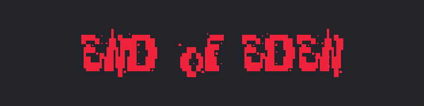
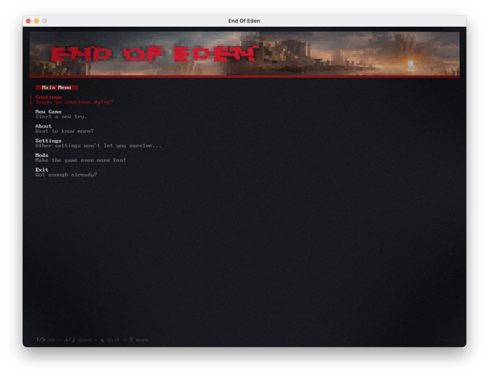
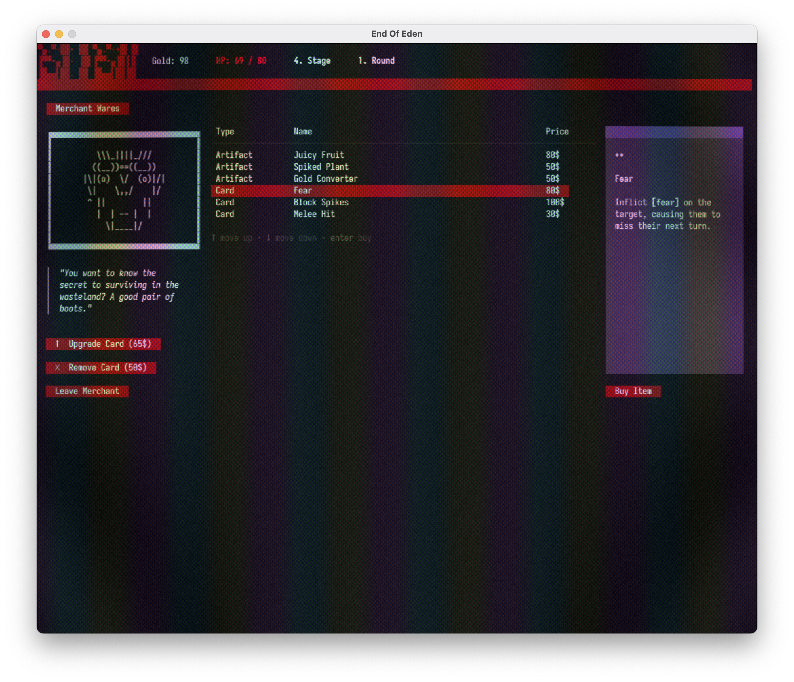
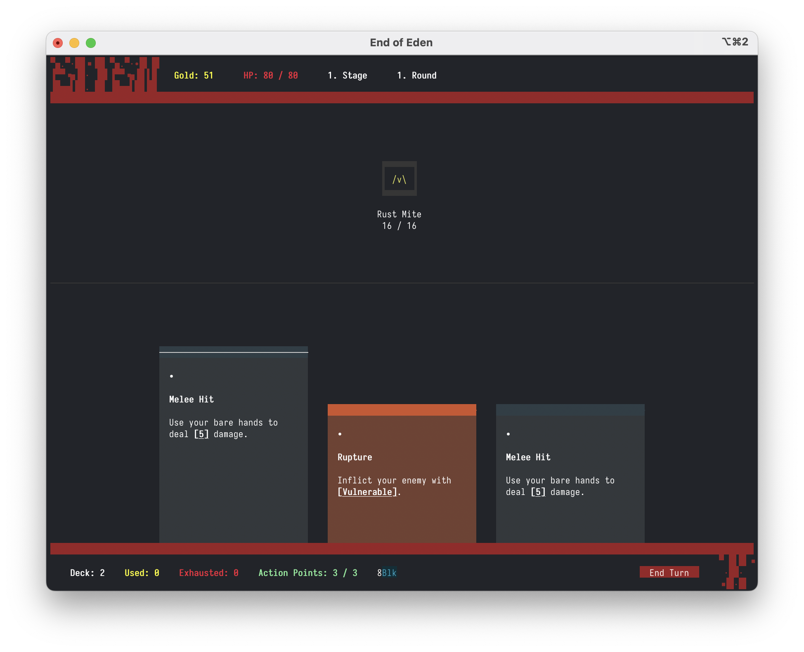
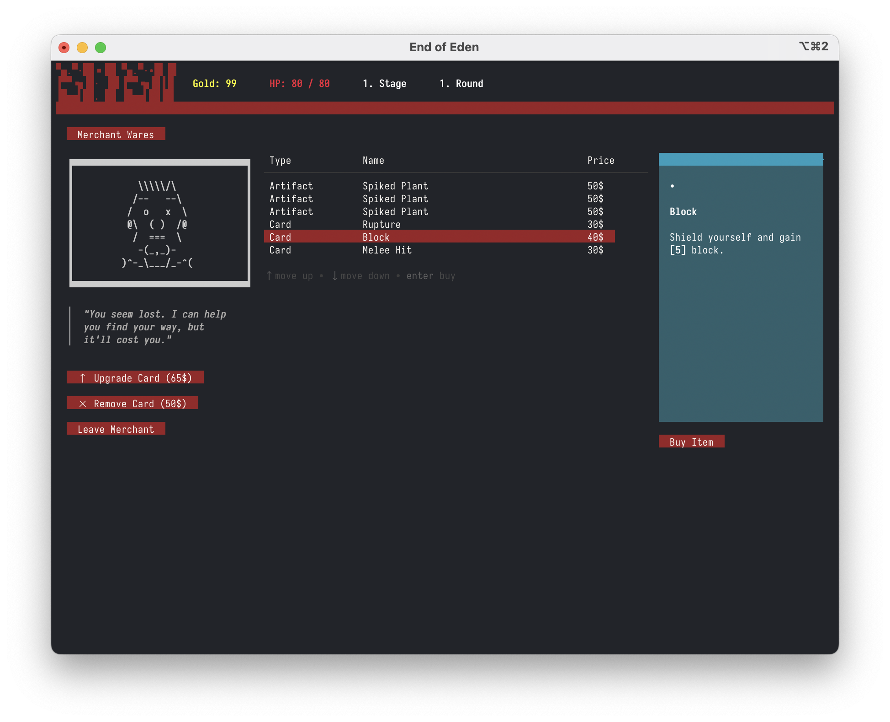
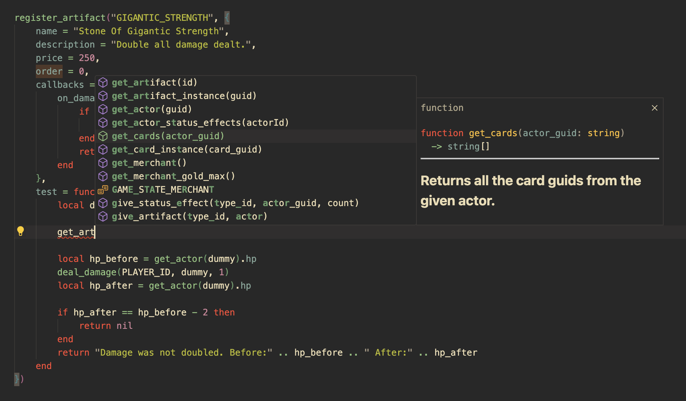

<p align="center">
  
</p>

<p align="right">
  <a href="README.md">🇬🇧 English</a> · <a href="README.ko.md">🇰🇷 한국어</a>
</p>

[](https://discord.gg/XpDvfvVuB2) [](https://goreportcard.com/report/github.com/BigJk/end_of_eden) [](https://github.com/BigJk/end_of_eden/releases)

> 미래 500년 뒤, 기후 변화와 핵전쟁으로 황폐해진 세계에 오신 걸 환영합니다. 남은 인간은 거의 사라지고, 그 자리는 변이체와 식물 기반 생물들이 차지했습니다. 이 곤조-판타지 설정 속에서, 당신은 잊혀진 지하 시설에서 냉동 수면에서 깨어납니다. 혼자이고, 다른 모든 냉동 수면 캡슐은 깨져 있습니다. 이 낯설고 위험한 세계를 헤쳐 나가며, 당신의 격리가 어떤 비밀로 인한 것인지 밝혀내야 합니다...

<a href="https://bigjk.itch.io/end-of-eden"></img></a>

**End of Eden...**
- "Slay the Spire"처럼 플레이하는 로그라이트 덱빌더 게임으로, 터미널에서 완전히 동작합니다
- 새로운 카드나 다양한 패시브 효과를 주는 아티팩트를 수집하세요
- 이상한 존재들과 충돌하며 가능한 한 오래 살아남으세요
- 기본 엔진을 사용해 자신만의 모드와 콘텐츠를 만드세요

# 스크린샷




<details><summary>터미널 버전 스크린샷</summary>




</details>

# 상태

게임은 아직 초기 개발 단계입니다. 아직 빠진 콘텐츠가 많고 게임의 밸런스가 전혀 잡혀 있지 않습니다. 현재는 대부분 테스트 콘텐츠만 들어 있습니다. 기여하고 싶으시다면 이슈나 풀 리퀘스트를 열어주시고, 더 좋은 방법은 [discord](https://discord.gg/XpDvfvVuB2)에 참여해 주세요.

# :video_game: 게임 방법

**빠른 시작:**

- 게임을 테스트만 해보고 싶다면: ``_gl`` 버전을 다운로드하세요
- 터미널을 떠나고 싶지 않다면: ``_term`` 버전을 다운로드하세요

**자세한 설명:**


게임을 두 가지 방법으로 플레이할 수 있습니다. ``_term`` 또는 ``_gl`` 버전을 다운로드할 수 있습니다. 다운로드한 파일 이름(``end_of_eden_term`` vs ``end_of_eden_gl``)으로 어떤 버전인지 알 수 있습니다. ``_term`` 버전은 기본 게임이며 터미널에서 실행됩니다. ``_gl`` 버전은 동일한 게임이지만 전용 창에서 실행되므로, 콘솔을 다룰 필요 없이 평범한 게임 창에서 플레이할 수 있습니다. 터미널에 익숙하지 않다면 ``_gl`` 버전을 시도해 보세요. 선택적으로 CRT 셰이더도 함께 제공되어 게임에 더 레트로한 느낌을 줍니다. 자세한 정보는 [설정](#설정) 섹션을 참조하세요.

## :file_folder: 다운로드

- 본인의 OS에 맞는 최신 게임 버전은 https://github.com/BigJk/end_of_eden/releases 에서 다운로드하세요
- **주의:** ``_term`` 버전의 게임은 제대로 동작하려면 모던 터미널이 필요합니다. 자세한 정보는 [콘솔](#콘솔) 섹션을 참조하세요.

## :whale: Docker

고급 사용자라면 도커를 통해서도 게임을 실행할 수 있습니다.

<details><summary>Docker 가이드</summary>

### 이미지 가져오기

```
docker pull ghcr.io/bigjk/end_of_eden:master
```

### 기본 게임

기본 게임을 도커로 실행할 수 있지만 오디오는 지원되지 않습니다. 환경 플래그를 통해 터미널 기능을 명시해야 합니다. 다음 예제는 ``xterm-256color`` 터미널을 사용하고 트루 컬러를 활성화합니다.

````
docker run --name end_of_eden -e TERM=xterm-256color -e COLORTERM=truecolor -it ghcr.io/bigjk/end_of_eden:master /app/end_of_eden --audio=false
````

``TERM`` 환경 변수의 가능한 옵션:
- ``xterm-256color``
- ``xterm``
- ``screen-256color``
- ``screen``
- ``vt100``
- 등...

``COLORTERM``은 터미널이 트루 컬러를 지원하는지 정의합니다. 모던 터미널을 사용한다면 ``truecolor``로 설정해도 안전합니다. 다른 옵션은 ``24bit``, ``16mil``, ``8bit``입니다.

### SSH 서버

````
docker run --name end_of_eden -p 8275:8273 -it ghcr.io/bigjk/end_of_eden:master /app/end_of_eden_ssh
````

</details>

## :bookmark_tabs: 설정

두 버전 모두 별도의 설정 파일을 가지고 있습니다. 설정 파일은 게임 실행 파일과 같은 위치에 있습니다. 첫 게임 시작 시 설정 파일이 자동으로 생성됩니다. 설정 파일이나 게임 내 설정 메뉴에서 설정을 변경할 수 있습니다.

### ``_term`` 버전

- 설정 파일 이름은 ``settings_term.toml``
- 게임 내 설정 메뉴를 통해 설정 변경 가능

<details><summary>settings.toml의 사용 가능한 설정</summary>

```toml
# 오디오 볼륨
#
volume = 1.0

# 로드할 모드 (게임 내에서도 수정 가능)
#
mods = [ "example_mod", "other_mod" ]
```

</details>

### ``_gl`` 버전

- 설정 파일 이름은 ``settings_gl.toml``
- 게임 내 설정 메뉴를 통해 설정 변경 가능

<details><summary>settings_gl.toml의 사용 가능한 설정</summary>

```toml
# 오디오 볼륨
#
volume = 1.0

# 로드할 모드 (게임 내에서도 수정 가능)
#
mods = [ "example_mod", "other_mod" ]

# 오디오 활성화 여부
#
audio = true

# CRT 셰이더 활성화 여부
#
crt = true

# 그레인 셰이더 활성화 여부
#
grain = true

# DPI 스케일링
#
dpi = 1

# 일반, 이탤릭, 굵은 텍스트에 사용될 폰트.
# 폰트는 ./assets/fonts를 기준으로 상대 경로여야 합니다.
# Nerd Font 사용을 권장합니다: https://www.nerdfonts.com/font-downloads
#
font_normal = 'BigBlueTermPlusNerdFont-Regular.ttf'
font_italic = 'BigBlueTermPlusNerdFont-Regular.ttf'
font_bold = 'BigBlueTermPlusNerdFont-Regular.ttf'

# 폰트 크기
#
font_size = 12

# 최대 FPS
#
fps = 30

# 창 크기
#
height = 800
width = 1100
```

</details>

## :tv: 콘솔

``_term`` 버전의 마우스 제어 등 모든 기능을 지원하려면 모던 콘솔이 필요합니다. 터미널에서 ``end_of_eden(.exe)`` 실행 파일을 시작하기만 하면 됩니다.

### 테스트된 터미널
| 터미널                                              | OS      | 상태                | 비고                                                          |
|------------------------------------------------------|---------|---------------------|---------------------------------------------------------------|
| **[terminal](https://github.com/microsoft/terminal)** | windows | :white_check_mark:  | windows에서 권장                                              |
| **cmd**                                               | windows | :warning:           | 마우스 모션 미지원, 마우스 클릭 및 기타 모든 기능은 동작       |
| **[iterm2](https://iterm2.com/)**                     | osx     | :white_check_mark:  |                                                               |

## :books: Lua & 모딩

Lua는 게임에서 아티팩트, 카드, 적 등 동적인 모든 것을 정의하는 데 사용됩니다. 이 덕분에 End of Eden을 쉽게 확장할 수 있습니다. 모드를 만들거나 Lua에 대해 더 알고 싶다면:

- [Lua 문서](docs/LUA_DOCS.md) 참조
- [게임 콘텐츠 문서](docs/GAME_CONTENT_DOCS.md) 참조

# :round_pushpin: 흥미로운 이야기

여기 게임에 대한 흥미로운 이야기를 몇 가지 공유합니다. 직접 만들면서 정말 재밌었거든요.

## 한국어 설정 방법

게임을 한국어로 플레이하려면 다음 단계를 따르세요:

**1) 한국어 설정 파일 만들기**

```bash
cd /Users/mac/work/end_of_eden
cat > settings_term.json <<'EOF'
{
  "audio": true,
  "volume": 1,
  "language": "ko"
}
EOF
```

**2) 빌드**

```bash
go build -o ./build/end_of_eden ./cmd/game
```

**3) 실행**

```bash
./build/end_of_eden
```

<details><summary>게임의 흥미로운 이야기 더 보기</summary>

<details><summary>게임은 자체 터미널 에뮬레이터를 가지고 있습니다</summary><br>

게임은 터미널에서 완벽하게 동작하지만, 비-터미널 사용자도 터미널을 직접 다루지 않고 게임을 플레이할 수 있는 방법을 제공하고 싶었습니다. 그래서 "Go로 간단한 터미널 에뮬레이터를 만드는 게 얼마나 어려울까?"라고 생각했습니다. 놀랍게도 그다지 어렵지 않았습니다. [CRT](https://github.com/BigJk/crt)를 작성하면서 정말 재밌게 놀았습니다. 좋은 부수 효과는 게임에 더 레트로한 느낌을 주는 CRT 셰이더를 포함할 수 있다는 것입니다.

</details>

<details><summary>게임에는 퍼지 테스터가 있습니다</summary><br>

Lua 스크립팅을 처음 통합할 때 많은 문제에 부딪혔습니다. 단순한 nil 역참조부터 Lua가 폭주하는 것까지, Lua 코드를 디버깅하는 것이 Go 자체를 디버깅하는 것만큼 쉽지 않습니다. 특정 이벤트 체인이 패닉을 일으키는 게임 코드의 엣지 케이스들이 많이 있었습니다. 이를 대응하기 위해 게임에 무작위 순서로 연산을 던져 패닉을 유발하는 작은 퍼지 테스터를 구현했습니다. 패닉이 발생하면 퍼지 테스터는 어떤 연산 체인이 어떤 값과 함께 패닉을 일으켰는지 보여줍니다.

다음은 무작위 대상으로 카드를 캐스트하는 예제 연산입니다. 또한 빈 문자열이나 다른 객체의 ID 같은 값도 선택합니다. 좋은 입력만 시스템에 던지지 않으면 퍼지 테스터가 아니니까요 ;)

```go
func castCardOp(rnd *rand.Rand, s *game.Session) string {
    guid := Shuffle(rnd, lo.Flatten([][]string{{""}, s.GetInstances(), s.GetActors()}))[0]
    target := Shuffle(rnd, lo.Flatten([][]string{{""}, s.GetInstances(), s.GetActors()}))[0]
    s.CastCard(guid, target)
    return fmt.Sprintf("Cast card with guid '%s' on '%s'", guid, target)
}
```

이는 이 게임의 CI에도 통합되어 있습니다. Lua나 Go를 변경하는 커밋이 푸시될 때마다, 퍼지 테스터는 2 코어에서 30초 동안 실행됩니다. 실패하면 CI 파이프라인이 실패합니다.

코드는 `/cmd/internal/fuzzy_tester`에서 확인하세요.

</details>

<details><summary>게임 콘텐츠는 단위 테스트가 가능합니다</summary><br>

게임 콘텐츠를 손으로 테스트하거나 예상대로 동작하는지 확인하는 것이 번거로울 수 있습니다. 가장 직접적인 방법은 게임에 들어가서 가지고 있는 디버그 터미널을 사용하고, 테스트할 때 필요한 아이템을 스스로 주는 것입니다. 다행히 "End of Eden"은 상당히 단순한 턴 기반 게임이며 복잡한 3D 작업이 없습니다. 그렇다면 왜 카드, 아티팩트 등을 단위 테스트하지 않을까요? 격리된 게임 콘텐츠를 테스트하는 것이 서로 결합할 때만 발생하는 특정 엣지 케이스를 찾는 데는 도움이 되지 않을 수 있지만, 기본 동작 검증에는 충분히 좋은 역할을 하며 매번 게임을 시작하지 않고도 빠르게 반복할 수 있게 해줍니다.

그래서 등록된 모든 게임 콘텐츠에서 테스트 함수를 실행하는 작은 테스트 유틸리티를 작성했습니다. 다음은 BLOCK 상태 효과에 대한 테스트 함수를 볼 수 있습니다. 각 테스트마다 깨끗한 게임 상태가 생성되고 주어진 게임 콘텐츠가 플레이어에게 주어집니다. 이 테스트에서 우리는 플레이어가 BLOCK 타입의 상태 효과를 하나 가지고 있음을 확인합니다. 그런 다음 적이 플레이어를 공격하도록 두고 피해가 예상대로 무효화되는지 확인합니다.

```lua
register_status_effect("BLOCK", {
    name = "Block",
    description = "Decreases incoming damage for each stack",
    -- ...
    test = function()
        return assert_chain({
            function() return assert_status_effect_count(1) end,
            function() return assert_status_effect("BLOCK", 1) end,
            function ()
                local dummy = add_actor_by_enemy("DUMMY")
                local damage = deal_damage(dummy, PLAYER_ID, 1)
                if damage ~= 0 then
                    return "Expected 0 damage, got " .. damage
                end

                damage = deal_damage(dummy, PLAYER_ID, 2)
                if damage ~= 2 then
                    return "Expected 2 damage, got " .. damage
                end
            end
        })
    end
})
```

이를 일반 Go 테스트에 통합하는 것은 쉬웠기에, 콘텐츠를 테스트하기 위해 `go test`를 사용하거나 독립 실행형 테스트 바이너리를 사용할 수 있습니다. 다음은 `go test`를 사용할 때의 출력 예제입니다:

```
=== RUN   TestGame
=== RUN   TestGame/Artifact:COMBAT_GLOVES
=== RUN   TestGame/Artifact:COMBAT_GLASSES
=== RUN   TestGame/Card:ENERGY_DRINK
=== RUN   TestGame/Card:ARM_MOUNTED_GUN
=== RUN   TestGame/Card:CROWBAR
=== RUN   TestGame/Card:VIBRO_KNIFE
=== RUN   TestGame/Card:ENERGY_DRINK_3
=== RUN   TestGame/Card:NANO_CHARGER
=== RUN   TestGame/Card:STIM_PACK
=== RUN   TestGame/Card:MELEE_HIT
=== RUN   TestGame/Card:ENERGY_DRINK_2
=== RUN   TestGame/Card:LZR_PISTOL
=== RUN   TestGame/Card:HAR_II
=== RUN   TestGame/StatusEffect:NANO_CHARGER
=== RUN   TestGame/StatusEffect:ULTRA_FLASH_SHIELD
=== RUN   TestGame/StatusEffect:BLOCK
=== RUN   TestGame/StatusEffect:BOUNCE_SHIELD
=== RUN   TestGame/StatusEffect:FLASH_BANG
=== RUN   TestGame/StatusEffect:FLASH_SHIELD
```

이것도 이 게임의 CI에 통합되어 있습니다. Lua나 Go를 변경하는 커밋이 푸시될 때마다 테스터가 실행됩니다. 실패하면 CI 파이프라인이 실패합니다.

코드는 `/cmd/internal/tester`에서 확인하세요.

</details>

<details><summary>게임은 자체 Lua 문서와 자동 완성을 생성합니다</summary><br>

저는 Lua와 그 문법을 그다지 좋아하지 않지만, 거의 모든 언어에 쉽게 임베드할 수 있다는 점이 마음에 듭니다. 게임을 포함해 정말 많은 곳에서 사용되므로, 많은 정보와 사용 가능한 라이브러리가 있습니다. 그래서 제 생각에는 이런 사실들이 문법에 대한 개인적인 단점보다 더 컸습니다. 제가 놓치고 있었던 유일한 것은 게임 API에 대한 멋진 자동 완성이었습니다. 그때 lua-language-server와 [정의](https://github.com/LuaLS/lua-language-server/wiki/Annotations)에 대한 훌륭한 지원에 대해 알게 되었습니다. 그래서 게임에서 변하지 않는 것들의 기본 정의를 작성했고, 나머지는 게임이 동적으로 생성합니다.

현재는 마크다운 기반 문서와 언어 서버용 주석을 생성하는 유틸리티가 있습니다. Lua 문서는 [여기](docs/LUA_API_DOCS.md)에서, 정의는 [여기](assets/scripts/definitions)에서 찾을 수 있습니다. 문서는 Lua 함수와 상수를 정의하는 코드에 정의되어 있습니다. 그렇게 함으로써 Lua 객체를 정의하는 동시에 문서도 작성합니다.

```go
d.Global("PLAYER_ID", "Player actor id for use in functions where the guid is needed, for example: ``deal_damage(PLAYER_ID, enemy_guid, 10)``.") // <- docs
l.SetGlobal("PLAYER_ID", lua.LString(PlayerActorID)) // <- lua

d.Function("guid", "returns a new random guid.", "guid") // <- docs
l.SetGlobal("guid", l.NewFunction(func(state *lua.LState) int {
    state.Push(lua.LString(NewGuid("LUA")))
    return 1
})) // <- lua
```

이는 다음과 같은 Lua 정의를 만듭니다:

```lua
--- Player actor id for use in functions where the guid is needed, for example: ``deal_damage(PLAYER_ID, enemy_guid, 10)``.
PLAYER_ID = ""

--- returns a new random guid.
---@return guid
function guid() end
```

그리고 `/assets/scripts` 폴더를 Visual Studio Code와 [Lua 확장](https://marketplace.visualstudio.com/items?itemName=sumneko.lua)으로 열면 타이핑할 때 멋진 자동 완성(대부분의 경우)을 얻을 수 있어 스크립팅 경험이 훨씬 좋아집니다!



코드는 `/cmd/internal/docs`에서 확인하세요.

</details>

</details>

## 빌드

### 자동

``./build.sh`` 스크립트를 사용해 모든 바이너리를 빌드할 수 있습니다. 스크립트는 ``bin`` 폴더를 만들고 모든 바이너리와 에셋을 그 안에 넣습니다. 시스템에 go가 설치되어 있지 않다면 스크립트는 [pkgx](https://pkgx.dev/)를 통해 자동으로 가져와 실행하라는 메시지를 표시합니다. pkgx는 자체 설치 없이 다양한 프로그램을 실행할 수 있는 패키지 관리 도구입니다.

### 수동

- golang ``>= 1.20`` 설치 필요
- 바이너리 빌드:
  - ``go build -o end_of_eden ./cmd/game/`` (터미널 버전)
  - ``go build -o end_of_eden ./cmd/game_win/`` (gl 버전)
- 이제 ``end_of_eden(.exe)`` 바이너리가 현재 디렉토리에서 사용 가능합니다
- 바이너리 빌드 없이 실행하려면 ``build`` 대신 ``run`` 사용 (예: ``go run ./cmd/game/``)
- **중요:** 게임의 작업 디렉토리는 ``./assets`` 폴더가 사용 가능한 곳이어야 합니다!

## 버전 관리

이 게임은 [의미론적 버전 관리](https://semver.org/)와 유사한 방식으로 버전 번호를 정의합니다. 이는 [Go Modules](https://go.dev/doc/modules/version-numbers) 버전 관리 체계와도 일치합니다.

v``Major``.``Minor``.``Patch``

- **Major:** Major 버전은 게임 개발의 주요 마일스톤입니다. ``0`` Major 버전은 게임의 초기 개발 단계를 나타내며, 아직 확정된 것이 없고 모든 것이 변경될 수 있습니다.
- **Minor:** Minor 버전은 새로운 기능이나 중요한 변경을 나타냅니다.
- **Patch:** 작은 변경, 버그 수정 및 개선.

# 소셜

- **itch.io:** https://bigjk.itch.io/end-of-eden
- **indiedb:** https://www.indiedb.com/games/end-of-eden

# 크레딧

- 얼굴 데이터를 공개한 **Huw Millward** 님께 감사드립니다 - [Warsim Generator Toolbox](https://huw2k8.itch.io/warsims-generator-toolbox)
- **Bleeoop**의 [Interface Beep Sounds](https://bleeoop.itch.io/interface-bleeps)
- **Juhani Junkala**의 [512 Sound Effect Pack](https://opengameart.org/content/512-sound-effects-8-bit-style)
- 음악 및 추가 오디오 작업 - [synthroton](https://synthroton.bandcamp.com/)

# 라이선스

- **코드:** MIT 라이선스
- **에셋:** 해당 폴더의 README.md 참조
