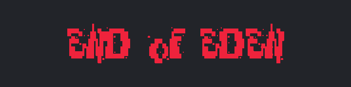
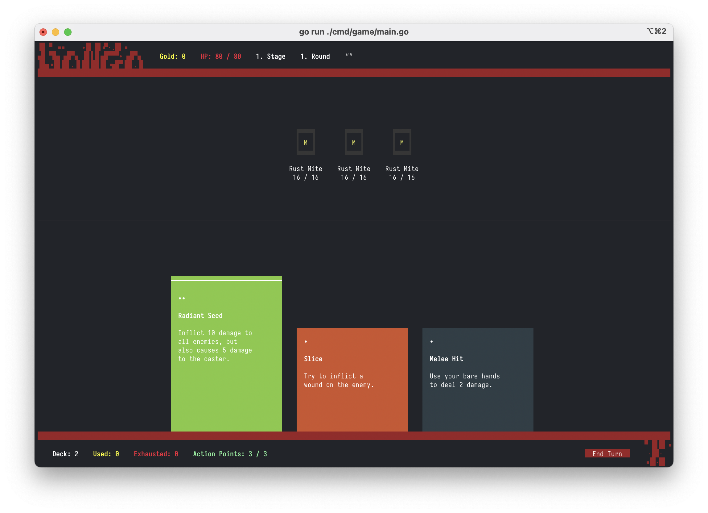
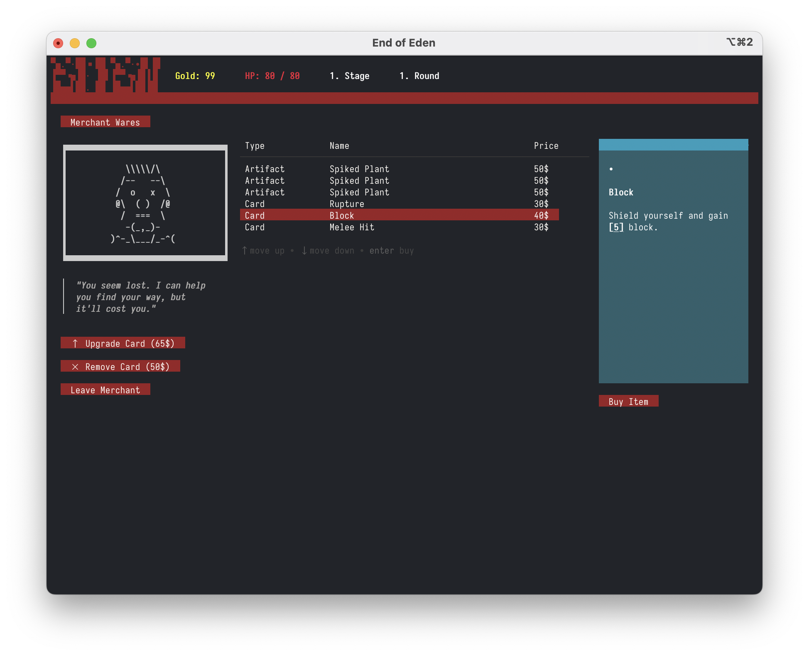

  

> Welcome to a world 500 years in the future, ravaged by climate change and nuclear wars. The remaining humans have become few and far between, replaced by mutated and plant-based creatures. In this gonzo-fantasy setting, you find yourself awakening from cryo sleep in an underground facility, long forgotten and alone. With all other cryosleep capsules broken, it's up to you to navigate this strange and dangerous world and uncover the secrets that led to your isolation...

**End of Eden...**
- Is a "Slay the Spire"-like, roguelite deck-builder game running fully in console
- Collect Artifacts that give you new cards or various passive effects
- Clash with strange beings and try to survive as long as possible

# Screenshots

# How to play

- You can play end_of_eden in
  - Console: ``end_of_eden``
  - Browser: ``end_of_eden_browser``
  - Over SSH: ``end_of_eden_ssh``

## Console

A modern console is required to support all the features like full mouse control. Just start the  ``end_of_eden(.exe)`` executable in your terminal.

### Tested Terminals

- osx: 
  - **item2:** no problems
- windows: 
  - **[terminal](https://github.com/microsoft/terminal):** no problems
  - **cmd:** no mouse motion support, mouse clicks and everything else works

# Tech

## Building

- You need golang ``>= 1.20`` installed
- Build binary: ``cd ./cmd/game && go build``
- Run without building binary: ``go run ./cmd/game/``
- **Important:** The games working directory needs to be where the ``./assets`` folder is available!

## Lua

Lua is used to define artifacts, cards, enemies and everything else that is dynamic in the game. This makes end_of_eden easily extendable. **Modding support coming soon!**

- The lua code tries to conform to the [luarocks style guide](https://github.com/luarocks/lua-style-guide).
- The [luafun](https://github.com/luafun/luafun) functional library is available by default to provide functions like ``map``, ``filter``, etc. which are very helpful. Check the [luafun docs](https://luafun.github.io/index.html) for more information.
- See ``./assets/scripts`` for the scripts of the base game.
- See [Lua Documentation](docs/LUA_DOCS.md)

