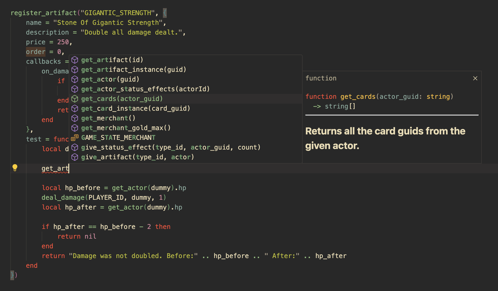

<p align="center">
  
</p>

[](https://discord.gg/XpDvfvVuB2) [](https://goreportcard.com/report/github.com/BigJk/end_of_eden) [](https://github.com/BigJk/end_of_eden/releases)

> Welcome to a world 500 years in the future, ravaged by climate change and nuclear wars. The remaining humans have become few and far between, replaced by mutated and plant-based creatures. In this gonzo-fantasy setting, you find yourself awakening from cryo sleep in an underground facility, long forgotten and alone. With all other cryosleep capsules broken, it's up to you to navigate this strange and dangerous world and uncover the secrets that led to your isolation...

<a href="https://bigjk.itch.io/end-of-eden"></img></a>

**End of Eden...**
- Is a "Slay the Spire"-like, roguelite deck-builder game running fully in console
- Collect Artifacts that give you new cards or various passive effects
- Clash with strange beings and try to survive as long as possible
- Use the base engine to create your own mods and content

# Screenshots


<details><summary>Terminal Version Screenshots</summary>


</details>

# Status

The game is still in early development. There are still a lot of content missing and the game is not balanced at all. It mostly contians test content at the moment. If you want to help out, feel free to open a issue or pull request or even better join the [discord](https://discord.gg/XpDvfvVuB2).

# :video_game: How to play

**Quickstart:**

- You just want to test the game: Download the ``_gl`` version
- You don't want to leave your terminal: Download the ``_term`` version

**Long Answer:**


The game can be played in two ways. You can download the ``_term`` or ``_gl`` version. You can see which type you download from the file name (``end_of_eden_term`` vs ``end_of_eden_gl``). The ``_term`` version is the base game and runs in your terminal. The ``_gl`` version is the same game but running in a dedicated window, so no console magic is needed just a plain old game window. If you are not familiar with the terminal, you can try out the ``_gl`` version. It also comes with a optional crt shader to give the game a more retro look. Check out the [Settings](#settings) section for more information.

## :file_folder: Download

- Download the latest game version for your OS here https://github.com/BigJk/end_of_eden/releases
- **Attention:** Keep in mind that the ``_term`` version of the game requires a modern terminal to run properly. See [Console](#console) for more information.

## :whale: Docker

If you are an advanced user you can also run the game through docker.

<details><summary>Docker Guide</summary>


### Pull Image

```
docker pull ghcr.io/bigjk/end_of_eden:master
```

### Base Game

You can run the base game through docker, but audio is not supported. You also have to specify the terminal capabilities via environment flags. The following example uses the ``xterm-256color`` terminal and enables true color support.

````
docker run --name end_of_eden -e TERM=xterm-256color -e COLORTERM=truecolor -it ghcr.io/bigjk/end_of_eden:master /app/end_of_eden --audio=false
````

Possible options for the ``TERM`` environment variable are:
- ``xterm-256color``
- ``xterm``
- ``screen-256color``
- ``screen``
- ``vt100``
and more...

``COLORTERM`` defines if the terminal supports true color. If you are using a modern terminal its probably safe to set this to ``truecolor``. Other options are ``24bit``, ``16mil`` and ``8bit``.

### SSH Server

````
docker run --name end_of_eden -p 8275:8273 -it ghcr.io/bigjk/end_of_eden:master /app/end_of_eden_ssh
````

</details>

## Settings

Both versions have separate settings files. The settings files are located in the same directory as the game executable. The settings files are automatically created on the first game start. You can modify the settings in the settings file or in game via the settings menu.

### ``_term`` Version

- The settings file is called ``settings_term.toml``
- The settings can be modified in game via the settings menu

<details><summary>Available settings in settings.toml</summary>

```toml
# Audio volume
#
volume = 1.0

# Mods that should be loaded (can be edited in game)
#
mods = [ "example_mod", "other_mod" ]
```

</details>

### ``_gl`` Version

- The settings file is called ``settings_gl.toml``
- The settings can be modified in game via the settings menu

<details><summary>Available settings in settings_gl.toml</summary>

```toml
# Audio volume
#
volume = 1.0

# Mods that should be loaded (can be edited in game)
#
mods = [ "example_mod", "other_mod" ]

# Enable or disable audio
#
audio = true

# Enable or disable the crt shader
#
crt = true

# Enable or disable the grain shader
#
grain = true

# DPI scaling
#
dpi = 1

# Font to be used for normal, italic and bold text.
# The font needs to be relative to ./assets/fonts.
# Using a nerd font is recommended: https://www.nerdfonts.com/font-downloads
#
font_normal = 'BigBlueTermPlusNerdFont-Regular.ttf'
font_italic = 'BigBlueTermPlusNerdFont-Regular.ttf'
font_bold = 'BigBlueTermPlusNerdFont-Regular.ttf'

# Font size
#
font_size = 12

# Max fps
#
fps = 30

# Window size
#
height = 800
width = 1100
```

</details>

## Console

A modern console is required to support all the features like full mouse control in the ``_term`` version. Just start the  ``end_of_eden(.exe)`` executable in your terminal.

### Tested Terminals
| Terminal                                              |   OS    | Status             | Note                                                            |
|-------------------------------------------------------|---------|--------------------|-----------------------------------------------------------------|
| **[terminal](https://github.com/microsoft/terminal)** | windows | :white_check_mark: | recommended on windows                                          |
| **cmd**                                               | windows | :warning:          | no mouse motion support, mouse clicks and everything else works |
| **[iterm2](https://iterm2.com/)**                     | osx     | :white_check_mark: |                                                                 |

## Lua & Modding

Lua is used to define artifacts, cards, enemies and everything else that is dynamic in the game. This makes End of Eden easily extendable. If you want to create mods or learn more about lua:

- See [Lua Documentation](docs/LUA_DOCS.md)

# Interesting bits and pieces

Here are some interesting bits and pieces about the game that I like to share as it was great fun to build them.

<details><summary>The game got its own terminal emulator</summary><br>

While the game can run in the terminal perfectly fine, I wanted to provide non-terminal users with a way to play the game without having to deal with the terminal themselves. So, I thought, "How hard can it be to write a simple terminal emulator in Go?" To my surprise, it wasn't that difficult. I had a lot of fun while writing [CRT](https://github.com/BigJk/crt). A nice side effect is the possibility of including CRT shaders that give the game an even more retro feeling.

</details>

<details><summary>The game has a fuzzy tester</summary><br>

I had a bunch of problems when I integrated the Lua scripting at the beginning. From simple nil dereference to Lua exploding on me, debugging the Lua code isn't as straightforward as debugging Go itself. I ran into a bunch of edge cases in my game's code where a certain chain of events would cause a panic. To counter that, I implemented a small fuzzy tester that throws operations at the game in random order, hoping to trigger a panic. If a panic happens, the fuzzy tester shows which chain of operations, together with which values, resulted in the panic.

Here is an example operation that will try to cast a card with a random target. It also picks values like empty strings or IDs of other objects. A fuzzy tester wouldn't be a fuzzy tester if it only threw nice input at the system ;)

```go
func castCardOp(rnd *rand.Rand, s *game.Session) string {
    guid := Shuffle(rnd, lo.Flatten([][]string{{""}, s.GetInstances(), s.GetActors()}))[0]
    target := Shuffle(rnd, lo.Flatten([][]string{{""}, s.GetInstances(), s.GetActors()}))[0]
    s.CastCard(guid, target)
    return fmt.Sprintf("Cast card with guid '%s' on '%s'", guid, target)
}
```

This is also integrated into the CI of this game. Each time a commit is pushed that changes Lua or Go, the fuzzy tester will be run for 30 seconds on 2 cores. If it fails, the CI pipeline fails.

Check the code out in `/cmd/internal/fuzzy_tester`.

</details>

<details><summary>The games content can be unit tested</summary><br>

Testing game content by hand or ensuring that it works as expected can be annoying. The most straightforward way is to go into the game, use whatever debugging terminal it has, and give yourself whatever items you need to test it. Fortunately, "End of Eden" is a rather simple game, turn-based, and has no complex 3D shenanigans. So, why not test cards, artifacts, etc., with unit tests? Testing game content in isolation might not help with finding certain edge cases that only happen in combination with each other, but it does a good job of validating the basic behavior and makes it easy to iterate quickly without having to start the game a bunch of times to see if everything works.

So, I wrote a small testing utility that executes the test function on all the registered game content. Here you can see the test function for the BLOCK status effect. For each test, a clean game state will be created, and the given game content is given to the player. In this test, we assert that the player has one status effect of the BLOCK type. Then we let an enemy damage the player and check if the damage is negated as expected.

```lua
register_status_effect("BLOCK", {
    name = "Block",
    description = "Decreases incoming damage for each stack",
    -- ...
    test = function()
        return assert_chain({
            function() return assert_status_effect_count(1) end,
            function() return assert_status_effect("BLOCK", 1) end,
            function ()
                local dummy = add_actor_by_enemy("DUMMY")
                local damage = deal_damage(dummy, PLAYER_ID, 1)
                if damage ~= 0 then
                    return "Expected 0 damage, got " .. damage
                end

                damage = deal_damage(dummy, PLAYER_ID, 2)
                if damage ~= 2 then
                    return "Expected 2 damage, got " .. damage
                end
            end
        })
    end
})
```

Integrating this into the normal Go testing was easy, so you can use go test to test the content or use the standalone testing binary. Here is an example output when using go test:

```
=== RUN   TestGame
=== RUN   TestGame/Artifact:COMBAT_GLOVES
=== RUN   TestGame/Artifact:COMBAT_GLASSES
=== RUN   TestGame/Card:ENERGY_DRINK
=== RUN   TestGame/Card:ARM_MOUNTED_GUN
=== RUN   TestGame/Card:CROWBAR
=== RUN   TestGame/Card:VIBRO_KNIFE
=== RUN   TestGame/Card:ENERGY_DRINK_3
=== RUN   TestGame/Card:NANO_CHARGER
=== RUN   TestGame/Card:STIM_PACK
=== RUN   TestGame/Card:MELEE_HIT
=== RUN   TestGame/Card:ENERGY_DRINK_2
=== RUN   TestGame/Card:LZR_PISTOL
=== RUN   TestGame/Card:HAR_II
=== RUN   TestGame/StatusEffect:NANO_CHARGER
=== RUN   TestGame/StatusEffect:ULTRA_FLASH_SHIELD
=== RUN   TestGame/StatusEffect:BLOCK
=== RUN   TestGame/StatusEffect:BOUNCE_SHIELD
=== RUN   TestGame/StatusEffect:FLASH_BANG
=== RUN   TestGame/StatusEffect:FLASH_SHIELD
```

This is also integrated into the CI of this game. Each time a commit is pushed that changes Lua or Go, the tester will be run. If it fails, the CI pipeline fails.

Check the code out in `/cmd/internal/tester`.

</details>


<details><summary>The games generates its own lua documentation + autocomplete</summary><br>

I'm not a huge fan of Lua and its syntax, but I like how easily it can be embedded into nearly any language. Because it is used in so many pieces, especially games, there is a lot of information and libraries available. So, in my opinion, these facts outweighed my personal cons about the syntax. The only thing that I was missing was nice auto-complete for the game's API. That's when I learned about the lua-language-server and its great support for [definitions](https://github.com/LuaLS/lua-language-server/wiki/Annotations). So, I wrote the basic definitions of things that don't change in the game, and the rest is generated dynamically by the game.

Currently, there is a utility to generate markdown-based documentation and the annotations for the language server. You can find the Lua docs [here](docs/LUA_API_DOCS.md) and definitions [here](assets/scripts/definitions). The docs are defined in code where I define Lua functions and constants. That way, I write the docs at the same moment that I define the Lua objects.

```go
d.Global("PLAYER_ID", "Player actor id for use in functions where the guid is needed, for example: ``deal_damage(PLAYER_ID, enemy_guid, 10)``.") // <- docs
l.SetGlobal("PLAYER_ID", lua.LString(PlayerActorID)) // <- lua

d.Function("guid", "returns a new random guid.", "guid") // <- docs
l.SetGlobal("guid", l.NewFunction(func(state *lua.LState) int {
    state.Push(lua.LString(NewGuid("LUA")))
    return 1
})) // <- lua
```

This results in lua definitions like:

```lua
--- Player actor id for use in functions where the guid is needed, for example: ``deal_damage(PLAYER_ID, enemy_guid, 10)``.
PLAYER_ID = ""

--- returns a new random guid.
---@return guid
function guid() end
```

And if you open the `/assets/scripts` folder with Visual Studio Code and the [Lua extension](https://marketplace.visualstudio.com/items?itemName=sumneko.lua), you will get nice autocomplete with typing (for the most part), which makes the scripting experience so much nicer!



Check the code out in `/cmd/internal/docs`.

</details>

## Building

### Automatic

You can use the ``./build.sh`` script to build all the binaries. The script will create a ``bin`` folder and put all the binaries and assets in there. If go is not installed on your system, the script will prompt to automatically fetch and run go via [pkgx](https://pkgx.dev/). pkgx is a package managment tool to run various programs without needing to install them yourself.

### Manual

- You need golang ``>= 1.20`` installed
- Build binary:
  - ``go build -o end_of_eden ./cmd/game/`` (terminal version)
  - ``go build -o end_of_eden ./cmd/game_win/`` (gl version)
- Now a ``end_of_eden(.exe)`` binary should be available in your current directory
- To run without building binaries use ``run`` instead of ``build`` (e.g. ``go run ./cmd/game/``)
- **Important:** The games working directory needs to be where the ``./assets`` folder is available!

## Versioning

The game uses versioning similar to [Semantic Versioning](https://semver.org/) to define the version number. This is also in accordance with the [Go Modules](https://go.dev/doc/modules/version-numbers) versioning scheme.

v``Major``.``Minor``.``Patch``

- **Major:** Major version represents a major milestone in the games development. A major version of ``0`` represents the early development phase of the game, where nothing is set in stone yet and everything can change.
- **Minor:** Minor version represents a new feature or a significant change.
- **Path:** Smaller changes, bug fixes and improvements.

# Socials

- **itch.io:** https://bigjk.itch.io/end-of-eden
- **indiedb:** https://www.indiedb.com/games/end-of-eden

# Credits

- Thanks to **Huw Millward** for the face data published in [Warsim Generator Toolbox](https://huw2k8.itch.io/warsims-generator-toolbox)
- [Interface Beep Sounds](https://bleeoop.itch.io/interface-bleeps) by **Bleeoop**
- [512 Sound Effect Pack](https://opengameart.org/content/512-sound-effects-8-bit-style) by **Juhani Junkala**
- Music and additional audio work by [synthroton](https://synthroton.bandcamp.com/)

# License

- **Code:** licensed under MIT
- **Assets:** See README.md in corresponding folder
