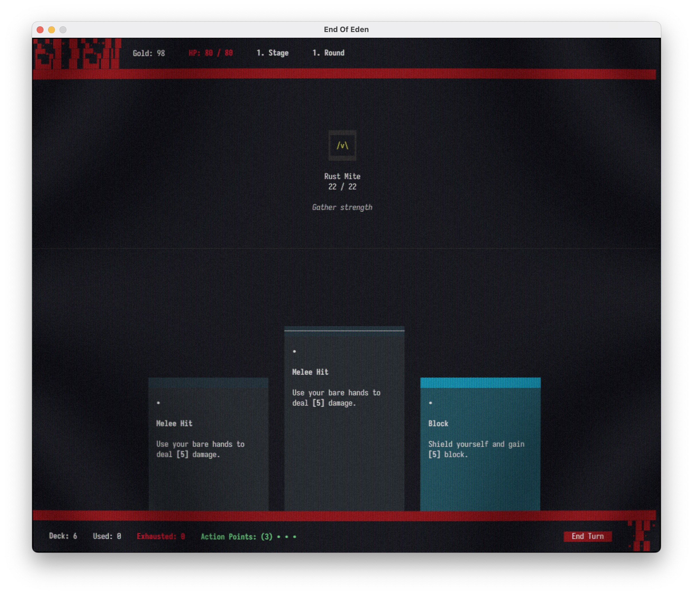

<p align="center">
  
</p>

[](https://discord.gg/XpDvfvVuB2) [](https://goreportcard.com/report/github.com/BigJk/end_of_eden) [](https://github.com/BigJk/end_of_eden/releases)

> Welcome to a world 500 years in the future, ravaged by climate change and nuclear wars. The remaining humans have become few and far between, replaced by mutated and plant-based creatures. In this gonzo-fantasy setting, you find yourself awakening from cryo sleep in an underground facility, long forgotten and alone. With all other cryosleep capsules broken, it's up to you to navigate this strange and dangerous world and uncover the secrets that led to your isolation...

**End of Eden...**
- Is a "Slay the Spire"-like, roguelite deck-builder game running fully in console
- Collect Artifacts that give you new cards or various passive effects
- Clash with strange beings and try to survive as long as possible
- Use the base engine to create your own mods and content


# Screenshots




<details><summary>Terminal Version Screenshots</summary>


</details>

# Status

The game is still in early development. There are still a lot of content missing and the game is not balanced at all. It mostly contians test content at the moment. If you want to help out, feel free to open a issue or pull request or even better join the [discord](https://discord.gg/XpDvfvVuB2).

# :video_game: How to play

**Quickstart:**

- You just want to test the game: Download the ``_gl`` version
- You don't want to leave your terminal: Download the ``_term`` version

**Long Answer:**


The game can be played in two ways. You can download the ``_term`` or ``_gl`` version. You can see which type you download from the file name (``end_of_eden_term`` vs ``end_of_eden_gl``). The ``_term`` version is the base game and runs in your terminal. The ``_gl`` version is the same game but running in a dedicated window, so no console magic is needed just a plain old game window. If you are not familiar with the terminal, you can try out the ``_gl`` version. It also comes with a optional crt shader to give the game a more retro look. Check out the [Settings](#settings) section for more information.

## :file_folder: Download

- Download the latest game version for your OS here https://github.com/BigJk/end_of_eden/releases
- **Attention:** Keep in mind that the ``_term`` version of the game requires a modern terminal to run properly. See [Console](#console) for more information.

## :whale: Docker

If you are an advanced user you can also run the game through docker.

<details><summary>Docker Guide</summary>


### Pull Image

```
docker pull ghcr.io/bigjk/end_of_eden:master
```

### Base Game

You can run the base game through docker, but audio is not supported. You also have to specify the terminal capabilities via environment flags. The following example uses the ``xterm-256color`` terminal and enables true color support.

````
docker run --name end_of_eden -e TERM=xterm-256color -e COLORTERM=truecolor -it ghcr.io/bigjk/end_of_eden:master /app/end_of_eden --audio=false
````

Possible options for the ``TERM`` environment variable are:
- ``xterm-256color``
- ``xterm``
- ``screen-256color``
- ``screen``
- ``vt100``
and more...

``COLORTERM`` defines if the terminal supports true color. If you are using a modern terminal its probably safe to set this to ``truecolor``. Other options are ``24bit``, ``16mil`` and ``8bit``.

### SSH Server

````
docker run --name end_of_eden -p 8275:8273 -it ghcr.io/bigjk/end_of_eden:master /app/end_of_eden_ssh
````

</details>

## Settings

Both versions have separate settings files. The settings files are located in the same directory as the game executable. The settings files are automatically created on the first game start. You can modify the settings in the settings file or in game via the settings menu.

### ``_term`` Version

- The settings file is called ``settings_term.toml``
- The settings can be modified in game via the settings menu

<details><summary>Available settings in settings.toml</summary>

```toml
# Audio volume
#
volume = 1.0

# Mods that should be loaded (can be edited in game)
#
mods = [ "example_mod", "other_mod" ]
```

</details>

### ``_gl`` Version

- The settings file is called ``settings_gl.toml``
- The settings can be modified in game via the settings menu

<details><summary>Available settings in settings_win.toml</summary>

```toml
# Audio volume
#
volume = 1.0

# Mods that should be loaded (can be edited in game)
#
mods = [ "example_mod", "other_mod" ]

# Enable or disable audio
#
audio = true

# Enable or disable the crt shader
#
crt = true

# Enable or disable the grain shader
#
grain = true

# DPI scaling
#
dpi = 1

# Font to be used for normal, italic and bold text.
# The font needs to be relative to ./assets/fonts.
# Using a nerd font is recommended: https://www.nerdfonts.com/font-downloads
#
font_normal = 'BigBlueTermPlusNerdFont-Regular.ttf'
font_italic = 'BigBlueTermPlusNerdFont-Regular.ttf'
font_bold = 'BigBlueTermPlusNerdFont-Regular.ttf'

# Font size
#
font_size = 12

# Max fps
#
fps = 30

# Window size
#
height = 800
width = 1100
```

</details>

## Console

A modern console is required to support all the features like full mouse control in the ``_term`` version. Just start the  ``end_of_eden(.exe)`` executable in your terminal.

### Tested Terminals
| Terminal                                              |   OS    | Status             | Note                                                            |
|-------------------------------------------------------|---------|--------------------|-----------------------------------------------------------------|
| **[terminal](https://github.com/microsoft/terminal)** | windows | :white_check_mark: | recommended on windows                                          |
| **cmd**                                               | windows | :warning:          | no mouse motion support, mouse clicks and everything else works |
| **[iterm2](https://iterm2.com/)**                     | osx     | :white_check_mark: |                                                                 |

## Lua & Modding

Lua is used to define artifacts, cards, enemies and everything else that is dynamic in the game. This makes End of Eden easily extendable. If you want to create mods or learn more about lua:

- See [Lua Documentation](docs/LUA_DOCS.md)

## Building

### Automatic

You can use the ``./build.sh`` script to build all the binaries. The script will create a ``bin`` folder and put all the binaries and assets in there. If go is not installed on your system, the script will prompt to automatically fetch and run go via [pkgx](https://pkgx.dev/). pkgx is a package managment tool to run various programs without needing to install them yourself.

### Manual

- You need golang ``>= 1.20`` installed
- Build binary:
  - ``go build -o end_of_eden ./cmd/game/`` (terminal version)
  - ``go build -o end_of_eden ./cmd/game_win/`` (gl version)
- Now a ``end_of_eden(.exe)`` binary should be available in your current directory
- To run without building binaries use ``run`` instead of ``build`` (e.g. ``go run ./cmd/game/``)
- **Important:** The games working directory needs to be where the ``./assets`` folder is available!

## Versioning

The game uses versioning similar to [Semantic Versioning](https://semver.org/) to define the version number. This is also in accordance with the [Go Modules](https://go.dev/doc/modules/version-numbers) versioning scheme.

v``Major``.``Minor``.``Patch``

- **Major:** Major version represents a major milestone in the games development. A major version of ``0`` represents the early development phase of the game, where nothing is set in stone yet and everything can change.
- **Minor:** Minor version represents a new feature or a significant change.
- **Path:** Smaller changes, bug fixes and improvements.

# Credits

- Thanks to **Huw Millward** for the face data published in [Warsim Generator Toolbox](https://huw2k8.itch.io/warsims-generator-toolbox)
- [Interface Beep Sounds](https://bleeoop.itch.io/interface-bleeps) by **Bleeoop**
- [512 Sound Effect Pack](https://opengameart.org/content/512-sound-effects-8-bit-style) by **Juhani Junkala**
- Music and additional audio work by [synthroton](https://synthroton.bandcamp.com/)

# License

- **Code:** licensed under MIT
- **Assets:** See README.md in corresponding folder
