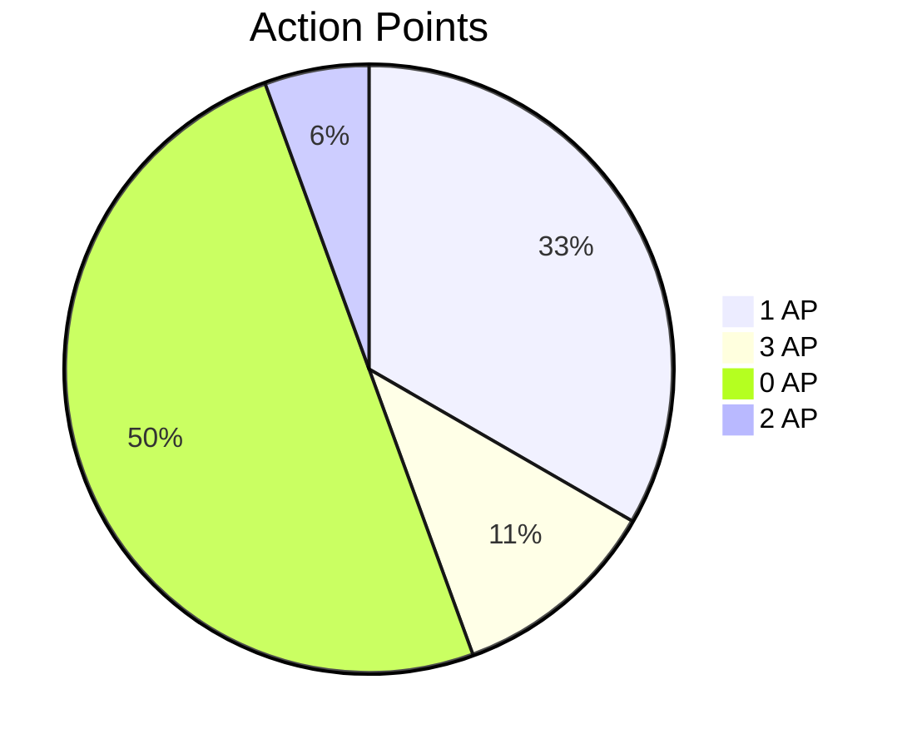
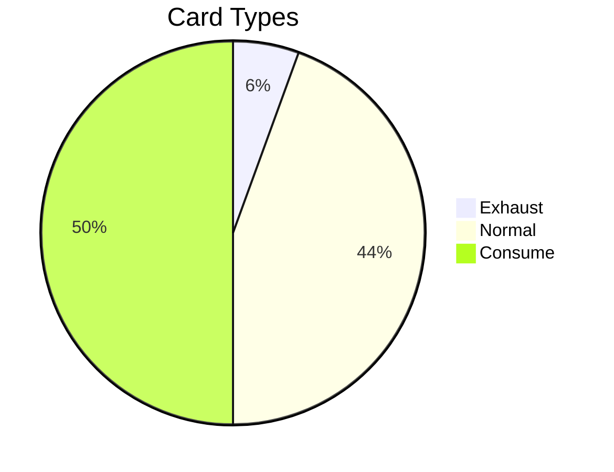

# Game Content
This document contains all game content that is available in the game. It is automatically generated and may be out of date.
Content that is dynamically generated at runtime is not included in this document, only content that is registered at the beginning of a session.


## Stats

|      Type      | Count |
|----------------|-------|
| Artifacts      | 10    |
| Cards          | 18    |
| Status Effects | 8     |
| Enemies        | 4     |
| Events         | 16    |


## Artifacts

|         ID          |      Name       |                                             Description                                             | Price |      Tags      |    Test Present    |
|---------------------|-----------------|-----------------------------------------------------------------------------------------------------|-------|----------------|--------------------|
| ``CROWBAR``         | Crowbar         | A crowbar. It's a bit rusty, but it should still be useful! Can be used in your hand.               | 80    | ATK, M, T, HND | :no_entry_sign:    |
| ``COMBAT_GLASSES``  | Combat Glasses  | Whenever you play a **Ranged (R)** card, deal **1 additional damage**                               | 100   | _ACT_0         | :heavy_check_mark: |
| ``COMBAT_GLOVES``   | Combat Gloves   | Whenever you play a **Meele (M)** card, deal **1 additional damage**                                | 100   | _ACT_0         | :heavy_check_mark: |
| ``PORTABLE_BUFFER`` | PRTBL Buffer    | Start each turn with 1 **Block**                                                                    | 100   | _ACT_0         | :no_entry_sign:    |
| ``SPEED_ENHANCER``  | Speed Enhancer  | Start with a additional card at the beginning of combat.                                            | 100   | _ACT_0         | :no_entry_sign:    |
| ``VIBRO_KNIFE``     | VIBRO Knife     | A VIBRO knife. Uses ultrasonic vibrations to cut through almost anything. Can be used in your hand. | 180   | ATK, M, T, HND | :no_entry_sign:    |
| ``INTERVA_JUICER``  | Interval Juicer | **Heal 2** at the beginning of combat                                                               | 200   | _ACT_0         | :no_entry_sign:    |
| ``ARM_MOUNTED_GUN`` | Arm Mounted Gun | Weapon that is mounted on your arm. It is very powerful.                                            | 250   | ARM            | :no_entry_sign:    |
| ``LZR_PISTOL``      | LZR Pistol      | A LZR pistol. Fires a concentrated beam of light. Can be used in your hand.                         | 280   | ATK, R, T, HND | :no_entry_sign:    |
| ``HAR_II``          | HAR-II          | A HAR-II. A heavy assault rifle with a high rate of fire. Can be used in your hand.                 | 380   | ATK, R, T, HND | :no_entry_sign:    |


## Cards

|           ID           |        Name        |                                              Description                                               | Action Points |      Exhaust       |     Consumable     | Max Level | Price |      Tags      |  Color  | Used Callbacks |    Test Present    |
|------------------------|--------------------|--------------------------------------------------------------------------------------------------------|---------------|--------------------|--------------------|-----------|-------|----------------|---------|----------------|--------------------|
| ``ARM_MOUNTED_GUN``    | Arm Mounted Gun    | Exhaust. Use your arm mounted gun to deal 15 (+3 for each upgrade) damage.                             | 3             | :heavy_check_mark: | :no_entry_sign:    | 1         | -1    | ATK, R, T, ARM | #2f3e46 | ``OnCast``     | :heavy_check_mark: |
| ``KILL``               | Kill               | Debug Card                                                                                             | 0             | :no_entry_sign:    | :no_entry_sign:    | 0         | -1    |                | #2f3e46 | ``OnCast``     | :no_entry_sign:    |
| ``KNOCK_OUT``          | Knock Out          | Inflicts **Knock Out** on the target, causing them to miss their next turn.                            | 2             | :no_entry_sign:    | :no_entry_sign:    | 0         | -1    | CC             | #725e9c | ``OnCast``     | :no_entry_sign:    |
| ``MELEE_HIT``          | Melee Hit          | Use your bare hands to deal 1 (+1 for each upgrade) damage.                                            | 1             | :no_entry_sign:    | :no_entry_sign:    | 1         | -1    | ATK, M, HND    | #2f3e46 | ``OnCast``     | :heavy_check_mark: |
| ``CROWBAR``            | Crowbar            | Use to deal 2 (+3 for each upgrade) damage.                                                            | 1             | :no_entry_sign:    | :no_entry_sign:    | 3         | 0     | ATK, M, T, HND | #2f3e46 | ``OnCast``     | :heavy_check_mark: |
| ``HAR_II``             | HAR-II             | Use to deal 5 (+3 for each upgrade) damage.                                                            | 1             | :no_entry_sign:    | :no_entry_sign:    | 3         | 0     | ATK, R, T, HND | #2f3e46 | ``OnCast``     | :heavy_check_mark: |
| ``LZR_PISTOL``         | LZR Pistol         | Use to deal 4 (+3 for each upgrade) damage.                                                            | 1             | :no_entry_sign:    | :no_entry_sign:    | 3         | 0     | ATK, R, T, HND | #2f3e46 | ``OnCast``     | :heavy_check_mark: |
| ``VIBRO_KNIFE``        | VIBRO Knife        | Use to deal 3 (+3 for each upgrade) damage.                                                            | 1             | :no_entry_sign:    | :no_entry_sign:    | 3         | 0     | ATK, M, T, HND | #2f3e46 | ``OnCast``     | :heavy_check_mark: |
| ``BLOCK``              | Block              | Shield yourself and gain 5 **block**.                                                                  | 1             | :no_entry_sign:    | :no_entry_sign:    | 1         | 50    | DEF            | #219ebc | ``OnCast``     | :no_entry_sign:    |
| ``BOUNCE_SHIELD``      | Bounce Shield      | **One-Time** - Deploy a temporary shield. **Negates** bounces the damage back, but still takes damage. | 0             | :no_entry_sign:    | :heavy_check_mark: | 0         | 150   | DEF, _ACT_0    | #219ebc | ``OnCast``     | :no_entry_sign:    |
| ``ENERGY_DRINK``       | ENRGY Drink X91    | **One-Time** - Gain 1 action point.                                                                    | 0             | :no_entry_sign:    | :heavy_check_mark: | 0         | 150   | UTIL, _ACT_0   | #fb5607 | ``OnCast``     | :heavy_check_mark: |
| ``FLASH_BANG``         | Flash Bang         | **One-Time** - Inflicts **Blinded** on the target, causing them to deal less damage.                   | 0             | :no_entry_sign:    | :heavy_check_mark: | 0         | 150   | CC, _ACT_0     | #725e9c | ``OnCast``     | :no_entry_sign:    |
| ``FLASH_SHIELD``       | Flash Shield       | **One-Time** - Deploy a temporary shield. **Negates** the next attack.                                 | 0             | :no_entry_sign:    | :heavy_check_mark: | 0         | 150   | DEF, _ACT_0    | #219ebc | ``OnCast``     | :no_entry_sign:    |
| ``NANO_CHARGER``       | Nano Charger       | **One-Time** - Supercharge your next attack. Deals **Double** damage.                                  | 0             | :no_entry_sign:    | :heavy_check_mark: | 0         | 150   | BUFF, _ACT_0   | #c1121f | ``OnCast``     | :heavy_check_mark: |
| ``STIM_PACK``          | Stim Pack          | **One-Time** - Restores **5** HP.                                                                      | 0             | :no_entry_sign:    | :heavy_check_mark: | 0         | 150   | HEAL, _ACT_0   | #219ebc | ``OnCast``     | :heavy_check_mark: |
| ``ENERGY_DRINK_2``     | ENRGY Drink X92    | **One-Time** - Gain 2 action points.                                                                   | 0             | :no_entry_sign:    | :heavy_check_mark: | 0         | 250   | UTIL, _ACT_0   | #fb5607 | ``OnCast``     | :heavy_check_mark: |
| ``ULTRA_FLASH_SHIELD`` | Ultra Flash Shield | **One-Time** - Deploy a temporary shield. **Negates** all attack this turn.                            | 3             | :no_entry_sign:    | :heavy_check_mark: | 0         | 250   | DEF, _ACT_0    | #219ebc | ``OnCast``     | :no_entry_sign:    |
| ``ENERGY_DRINK_3``     | ENRGY Drink X93    | **One-Time** - Gain 3 action points.                                                                   | 0             | :no_entry_sign:    | :heavy_check_mark: | 0         | 350   | UTIL, _ACT_0   | #fb5607 | ``OnCast``     | :heavy_check_mark: |


### Action Points




### Card Types




## Status Effects

|           ID           |        Name        |                    Description                    | Look | Foreground |     Can Stack      |   Decay   | Rounds |  Used Callbacks  |    Test Present    |
|------------------------|--------------------|---------------------------------------------------|------|------------|--------------------|-----------|--------|------------------|--------------------|
| ``CHARGED``            | Charged            | Attacks will deal more damage per stack.          | CHRG | #207BE7    | :heavy_check_mark: | DecayNone | 0      | ``OnDamageCalc`` | :no_entry_sign:    |
| ``FLASH_BANG``         | Blinded            | Causing **25%** less damage.                      | FL   | #725e9c    | :heavy_check_mark: | DecayOne  | 1      | ``OnDamageCalc`` | :heavy_check_mark: |
| ``KNOCK_OUT``          | Knock Out          | Can't act                                         | KO   | #725e9c    | :heavy_check_mark: | DecayOne  | 1      | ``OnTurn``       | :no_entry_sign:    |
| ``BLOCK``              | Block              | Decreases incoming damage for each stack          | B    | #219ebc    | :heavy_check_mark: | DecayAll  | 1      | ``OnDamageCalc`` | :heavy_check_mark: |
| ``BOUNCE_SHIELD``      | Bounce Shield      | Bounces back the next damage. Still takes damage. | BS   | #219ebc    | :no_entry_sign:    | DecayAll  | 1      | ``OnDamageCalc`` | :heavy_check_mark: |
| ``FLASH_SHIELD``       | Flash Shield       | Negates the next attack.                          | FS   | #219ebc    | :no_entry_sign:    | DecayAll  | 1      | ``OnDamageCalc`` | :heavy_check_mark: |
| ``NANO_CHARGER``       | Nano Charge        | Next attack deals **Double** damage.              | NC   | #c1121f    | :no_entry_sign:    | DecayAll  | 1      | ``OnDamageCalc`` | :heavy_check_mark: |
| ``ULTRA_FLASH_SHIELD`` | Ultra Flash Shield | Negates all attacks.                              | UFS  | #219ebc    | :no_entry_sign:    | DecayAll  | 1      | ``OnDamageCalc`` | :heavy_check_mark: |


## Enemies

|        ID        |     Name     |             Description              | Initial HP | Max HP |                               Look                               |  Color  |        Used Callbacks        |  Test Present   |
|------------------|--------------|--------------------------------------|------------|--------|------------------------------------------------------------------|---------|------------------------------|-----------------|
| ``CYBER_SPIDER`` | CYBER Spider | It waits for its prey to come closer | 8          | 8      | <code style='white-space: pre;'>/\\o^o/\\ </code>                | #ff4d6d | ``OnTurn``                   | :no_entry_sign: |
| ``CLEAN_BOT``    | Cleaning Bot | It never stopped cleaning...         | 13         | 13     | <code style='white-space: pre;'> \\_/</br>(* *)</br> )#( </code> | #32a891 | ``OnPlayerTurn``, ``OnTurn`` | :no_entry_sign: |
| ``DUMMY``        | Dummy        | End me...                            | 100        | 100    | <code style='white-space: pre;'>DUM </code>                      | #deeb6a | ``OnTurn``                   | :no_entry_sign: |
| ``RUST_MITE``    | Rust Mite    | A small robot that eats metal.       | 12         | 12     | <code style='white-space: pre;'>/v\\ </code>                     | #e6e65a | ``OnTurn``                   | :no_entry_sign: |


## Events

|              ID              |                Name                |                                                                                                                                                                                                                                                                                                                                                                                                                                                                                                                                                                                                                                                      Description                                                                                                                                                                                                                                                                                                                                                                                                                                                                                                                                                                                                                                                      |              Tags              |                                                             Choices                                                              |  Test Present   |
|------------------------------|------------------------------------|-----------------------------------------------------------------------------------------------------------------------------------------------------------------------------------------------------------------------------------------------------------------------------------------------------------------------------------------------------------------------------------------------------------------------------------------------------------------------------------------------------------------------------------------------------------------------------------------------------------------------------------------------------------------------------------------------------------------------------------------------------------------------------------------------------------------------------------------------------------------------------------------------------------------------------------------------------------------------------------------------------------------------------------------------------------------------------------------------------------------------------------------------------------------------------------------------------------------------------------------------------------------------------------------------------------------------|--------------------------------|----------------------------------------------------------------------------------------------------------------------------------|-----------------|
| ``GAIN_GOLD_ACT_0``          |                                    | ... -                                                                                                                                                                                                                                                                                                                                                                                                                                                                                                                                                                                                                                                                                                                                                                                                                                                                                                                                                                                                                                                                                                                                                                                                                                                                                                                 | _ACT_0                         | <ul><li>``Take it! [Gain 20 Gold]``</li> <li>``Leave!``</li></ul>                                                                | :no_entry_sign: |
| ``MERCHANT``                 | A strange figure                   | !!merchant.jpg -      - The merchant is a tall, lanky figure draped in a long, tattered coat made of plant fibers and animal hides. Their face is hidden behind a mask made of twisted roots and vines, giving them an unsettling, almost alien appearance. - Despite their strange appearance, the merchant is a shrewd negotiator and a skilled trader. They carry with them a collection of bizarre and exotic items, including plant-based weapons, animal pelts, and strange, glowing artifacts that seem to pulse with an otherworldly energy. - The merchant is always looking for a good deal, and they're not above haggling with potential customers...                                                                                                                                                                                                                                                                                                                                                                                                                                                                                                                                                                                                                                                     | _ACT_0, _ACT_1, _ACT_2, _ACT_3 | <ul><li>``Trade``</li> <li>``Pass``</li></ul>                                                                                    | :no_entry_sign: |
| ``CLEAN_BOT``                | Corpse. Clean. Engage.             | !!clean_bot.jpg - While exploring the facility you hear a strange noise. Suddenly a strange robot appears from one of the corridors. - It seems to be cleaning up the area, but it's not working properly anymore and you can see small sparks coming out of it. - It looks at you and says "Corpse. Clean. Engage.". - **You're not sure what it means, but it doesn't seem to be friendly!** -                                                                                                                                                                                                                                                                                                                                                                                                                                                                                                                                                                                                                                                                                                                                                                                                                                                                                                                      | _ACT_0_FIGHT                   | <ul><li>``Fight!``</li></ul>                                                                                                     | :no_entry_sign: |
| ``GAMBLE_1_ACT_0``           | Electro Barrier                    | You find a room with a strange device in the middle. It seems to be some kind of electro barrier protecting a storage container. You can either try to disable the barrier or leave. -                                                                                                                                                                                                                                                                                                                                                                                                                                                                                                                                                                                                                                                                                                                                                                                                                                                                                                                                                                                                                                                                                                                                | _ACT_0                         | <ul><li>``50% [Gain Artifact & Consumeable] 50% [Take 5 damage]``</li> <li>``Leave!``</li></ul>                                  | :no_entry_sign: |
| ``CROWBAR``                  | Found: Crowbar                     | !!red_room.jpg - **You found something!** A crowbar. It's a bit rusty, but it should still be useful! - **Important:** If you already carry a artifact in your hand, you will have to drop it and related cards to pick up the new one.                                                                                                                                                                                                                                                                                                                                                                                                                                                                                                                                                                                                                                                                                                                                                                                                                                                                                                                                                                                                                                                                               | _ACT_0                         | <ul><li>````</li> <li>``Leave...``</li></ul>                                                                                     | :no_entry_sign: |
| ``HAR_II``                   | Found: HAR-II                      | !!artifact_chest.jpg - **You found something!** A HAR-II. A heavy assault rifle with a high rate of fire. - **Important:** If you already carry a artifact in your hand, you will have to drop it and related cards to pick up the new one.                                                                                                                                                                                                                                                                                                                                                                                                                                                                                                                                                                                                                                                                                                                                                                                                                                                                                                                                                                                                                                                                           | _ACT_1                         | <ul><li>````</li> <li>``Leave...``</li></ul>                                                                                     | :no_entry_sign: |
| ``LZR_PISTOL``               | Found: LZR Pistol                  | !!artifact_chest.jpg - **You found something!** A LZR pistol. Fires a concentrated beam of light. - **Important:** If you already carry a artifact in your hand, you will have to drop it and related cards to pick up the new one.                                                                                                                                                                                                                                                                                                                                                                                                                                                                                                                                                                                                                                                                                                                                                                                                                                                                                                                                                                                                                                                                                   | _ACT_1                         | <ul><li>````</li> <li>``Leave...``</li></ul>                                                                                     | :no_entry_sign: |
| ``VIBRO_KNIFE``              | Found: VIBRO Knife                 | !!artifact_chest.jpg - **You found something!** A VIBRO knife. Uses ultrasonic vibrations to cut through almost anything. - **Important:** If you already carry a artifact in your hand, you will have to drop it and related cards to pick up the new one.                                                                                                                                                                                                                                                                                                                                                                                                                                                                                                                                                                                                                                                                                                                                                                                                                                                                                                                                                                                                                                                           | _ACT_0                         | <ul><li>````</li> <li>``Leave...``</li></ul>                                                                                     | :no_entry_sign: |
| ``GOLD_TO_HP_ACT_0``         | Old Vending Machine                | You find an old vending machine, it seems to be still working. You can either pay 20 Gold to get 5 HP or leave. -                                                                                                                                                                                                                                                                                                                                                                                                                                                                                                                                                                                                                                                                                                                                                                                                                                                                                                                                                                                                                                                                                                                                                                                                     | _ACT_0                         | <ul><li>``Pay [20 Gold] [Gain 5 HP]``</li> <li>``Leave!``</li></ul>                                                              | :no_entry_sign: |
| ``RANDOM_ARTIFACT_ACT_0``    | Random Artifact                    | !!artifact_chest.jpg - You found a chest with a strange symbol on it. The chest is protected by a strange barrier. You can either open it and take some damage or leave. -                                                                                                                                                                                                                                                                                                                                                                                                                                                                                                                                                                                                                                                                                                                                                                                                                                                                                                                                                                                                                                                                                                                                            | _ACT_0                         | <ul><li>``Random Artifact [Gain 1 Artifact] [Take 5 damage]``</li> <li>``Leave!``</li></ul>                                      | :no_entry_sign: |
| ``RANDOM_CONSUMEABLE_ACT_0`` | Random Consumeable                 | !!artifact_chest.jpg - You found a chest with a strange symbol on it. The chest is protected by a strange barrier. You can either open it and take some damage or leave. -                                                                                                                                                                                                                                                                                                                                                                                                                                                                                                                                                                                                                                                                                                                                                                                                                                                                                                                                                                                                                                                                                                                                            | _ACT_0                         | <ul><li>``Random Artifact [Gain 1 Consumeable] [Take 2 damage]``</li> <li>``Leave!``</li></ul>                                   | :no_entry_sign: |
| ``MAX_LIFE_ACT_0``           | Symbiotic Parasite                 | You find a strange creature, it seems to be a symbiotic parasite. It offers to increase your max HP by 5. You can either accept or leave. -                                                                                                                                                                                                                                                                                                                                                                                                                                                                                                                                                                                                                                                                                                                                                                                                                                                                                                                                                                                                                                                                                                                                                                           | _ACT_0                         | <ul><li>``Accept it! [Gain 5 Max HP]``</li> <li>``Leave!``</li></ul>                                                             | :no_entry_sign: |
| ``RUST_MITE``                | Tasty metals...                    | !!rust_mite.jpg - You are walking through the facility hoping to find a way out. After a few turns you hear a strange noise. You look around and come across a strange being. - It seems to be eating the metal from the walls. It looks at you and after a few seconds it rushes towards you. - **It seems to be hostile!** -                                                                                                                                                                                                                                                                                                                                                                                                                                                                                                                                                                                                                                                                                                                                                                                                                                                                                                                                                                                        | _ACT_0_FIGHT                   | <ul><li>``Fight!``</li></ul>                                                                                                     | :no_entry_sign: |
| ``UPRAGDE_CARD_ACT_0``       | Upgrade Station                    | You find a old automatic workstation. You are able to get it working again. You can either upgrade a random card or leave. -                                                                                                                                                                                                                                                                                                                                                                                                                                                                                                                                                                                                                                                                                                                                                                                                                                                                                                                                                                                                                                                                                                                                                                                          | _ACT_0                         | <ul><li>``Upgrade a card [Upgrade a card] [Take 5 damage]``</li> <li>``Leave!``</li></ul>                                        | :no_entry_sign: |
| ``START``                    | Waking up...                       | !!cryo_start.jpg - You wake up in a dimly lit room, the faint glow of a red emergency light casting an eerie hue over the surroundings. The air is musty and stale, the metallic scent of the cryo-chamber still lingering in your nostrils. You feel groggy and disoriented, your mind struggling to process what's happening. - As you try to sit up, you notice that your body is stiff and unresponsive. It takes a few moments for your muscles to warm up and regain their strength. Looking around, you see that the walls are made of a dull gray metal, covered in scratches and scuff marks. There's a faint humming sound coming from somewhere, indicating that the facility is still operational. - You try to remember how you ended up here, but your memories are hazy and fragmented. The last thing you recall is a blinding flash of light and a deafening boom. You must have been caught in one of the nuclear explosions that devastated the world. - As you struggle to gather your bearings, you notice a blinking panel on the wall, with the words *"Cryo Sleep Malfunction"* displayed in bold letters. It seems that the system has finally detected the error that caused your prolonged slumber and triggered your awakening. - **Shortly after you realize that you are not alone...** |                                | <ul><li>``Try to find a weapon. [Find meele weapon] [Take 4 damage]``</li> <li>``Gather your strength and attack it!``</li></ul> | :no_entry_sign: |
| ``CYBER_SPIDER``             | What is this thing at the ceiling? | !!cyber_spider.jpg - You come around a corner and see a strange creature hanging from the ceiling. It looks like a spider, but it's made out of metal. - It seems to be waiting for its prey to come closer and there is no way around it. -                                                                                                                                                                                                                                                                                                                                                                                                                                                                                                                                                                                                                                                                                                                                                                                                                                                                                                                                                                                                                                                                          | _ACT_0_FIGHT                   | <ul><li>``Fight!``</li></ul>                                                                                                     | :no_entry_sign: |
