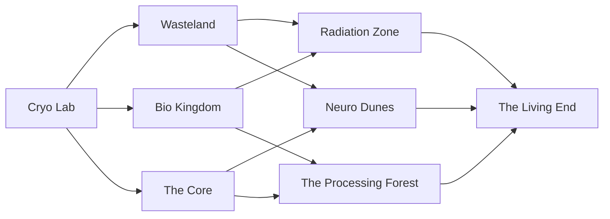

# Game Design Document

## Basic Overview

End Of Eden is a turn-based deck-building roguelite game with a focus on strategy and decision-making. The game is set in a post-apocalyptic world where the player must survive against the harsh environment and the monsters that roam the land. The player must build their deck by collecting cards and artifacts from the world and use them to defeat enemies and progress through the game.

### Deck Building

By deck-building we mean that the player will have a deck of cards that they will use to fight enemies and progress through the game. The player will start with a basic deck of cards and will be able to add more cards to their deck as they progress through the game. The player will also be able to remove cards from their deck if they wish to do so. The player will be able to see their deck and the cards that are in it at any time during the game.

## Roguelite

By roguelite we mean that the game features permadeath and each run of the game will be unique due to the procedural generation of certain event orders, artifact drops and enemy spawn.

## Game Mechanics

### Energy

Energy is the most basic resource in the game. It is used to play cards each turn. The energy pool will reset at the beginning of each turn. The pool can be increased by using artifacts or by playing certain cards.

### Health

Health is the player's life. When the player's health reaches 0 they will die and the game will end. Health isn't restored between fights. The player's health can be increased by using artifacts, encountering certain events or by playing cards.

### Gold

Gold is the currency of the game. It is used to buy cards and artifacts from the merchant. Gold is gained by defeating enemies and encountering certain events.

### Cards

A card is a basic unit of the game. Each card has a name, a description and a cost. The cost of a card is the amount of energy that the player must spend in order to play the card. The player will start with a basic deck of cards and will be able to add more cards to their deck as they progress through the game. The player will also be able to remove cards from their deck if they wish to do so.

### Artifacts

An artifact is an item that the player can collect during the game. Each artifact has a name, a description and an effect. The effect of an artifact can effect various areas of the game. It can increase the damage of the player's attacks, increase the player's energy pool, give the player a new ability and much more.

### Status Effects

A status effect is like a buff or debuff that can be applied to the player or enemy. Status effects can have various positive or negative effects. Their effects can stack and the effects can scale by the number of stacks. Status effects have a decay type which determines how their stacks degrade each turn. This can either be 1 stack per turn, all stacks per turn or no decay at all. If a stack reaches 0 stacks it will be removed.

### Enemies

A enemy is a unit that the player must fight. Each enemy has a name, a description and a set of attacks. The player will have to defeat the enemy in order to progress through the game. The player will be able to see the enemy's health, status effects and the attacks that they will use during the fight. Being able to see the intend of the enemy's attacks will allow the player to plan their moves accordingly.

### Events

A event is a choice that the player faces. Each event has a name, a flavour text and a set number of choices to choose from. Events can reward the player artifacts, cards, alter the course of the run or lead to fights.

### Merchant

The merchant is a special type of event which occurs in certain intervals. The merchant allows the player to buy cards, sell cards, upgrade cards, remove cards and buy artifacts. The selection of cards and artifacts that the merchant offers will be randomised.

### Story Teller

The story teller is the behind the scenes system that determines the rough order of events and enemies that the player will face.

## Game Flow

...

## Game Progression

The game will start in a cryo facility. After that the player will either go to the wasteland, the bio kingdom or the core. From that point it depends on which area the player is in. For example if the player is in the wasteland he will randomly end up in either the radiation zone or the neuro dunes. The idea is that the area should be a mix of two of the other areas.

### Stage 1

**Wasteland**

- Hot, Sand, Nuked city leftover
- Mutated beings adapted to the wasteland

**Bio Kingdom**

- Mutated Jungle
- Mutated plant-based beings

**The Core**

- Bigger underground facility
- Mutated computer horrors

### Stage 2

**Radiation Zone**

- Wasteland + Bio Kingdom
- Urban, Nuked City combined with overgrown plants
- Mutated animal + plant based

**Neuro Dunes**

- Wasteland + The Core
- Pitch black sand (nano particles)
- Horror bio flesh monsters

**The Processing Forest**

- Bio Kingdom + The Core
- Plants fused with tech
- Mutated animal + tech

### Final Stage: The Living End

...
